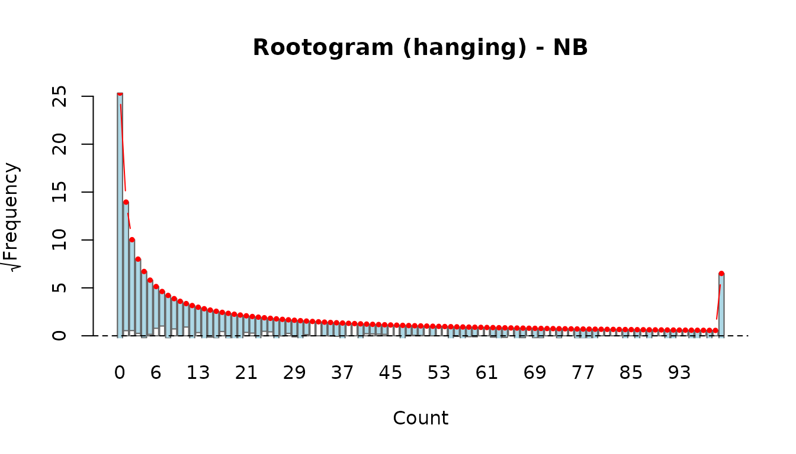
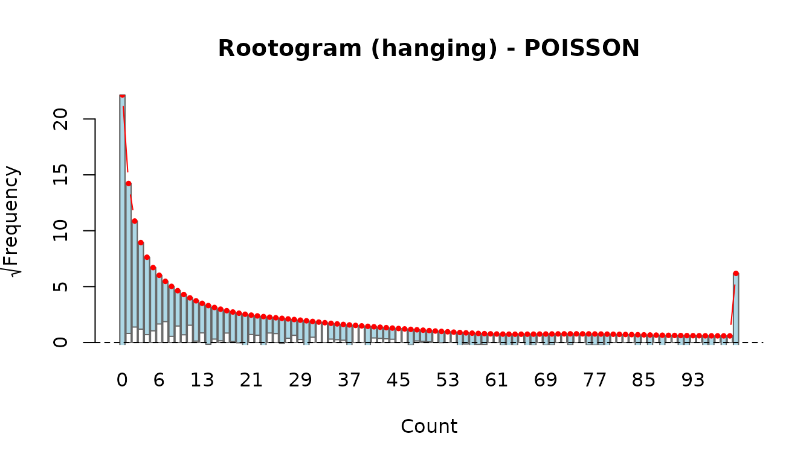
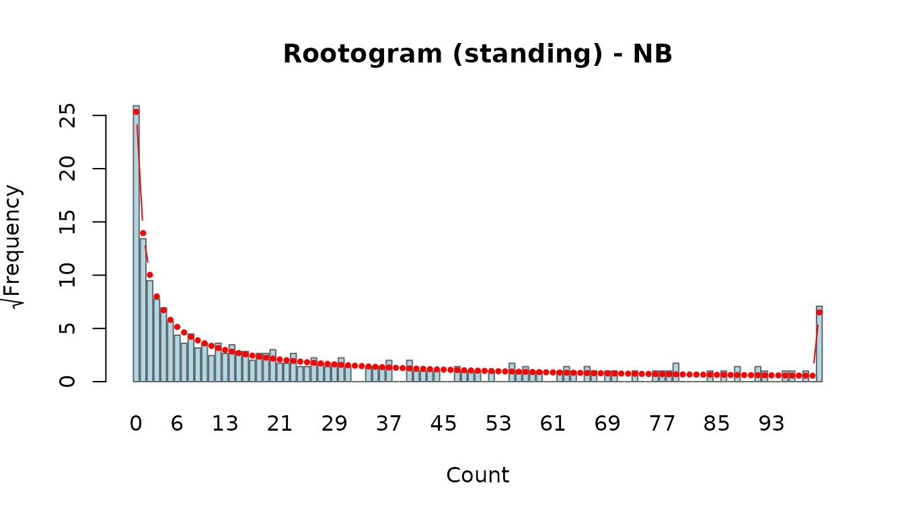
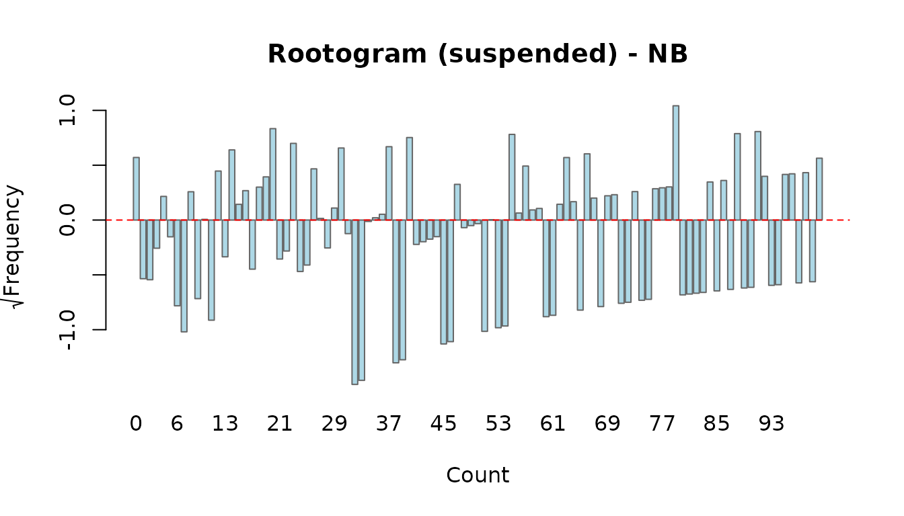
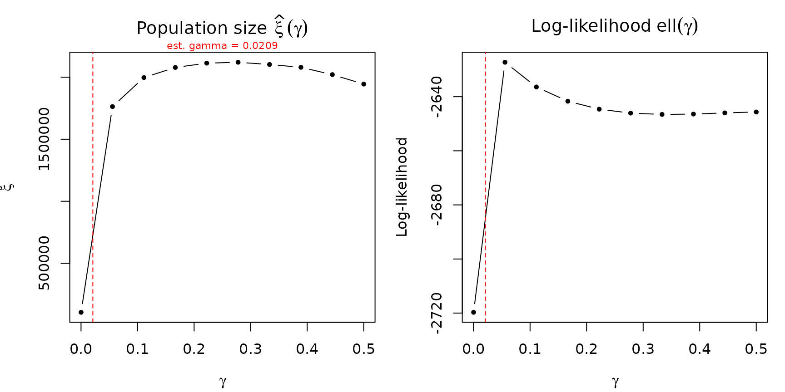

# Model Diagnostics and Comparison

This vignette demonstrates the diagnostic and model-comparison tools
available in the **uncounted** package. We cover goodness-of-fit
statistics, residual analysis, rootograms, exploratory log-log plots,
leave-one-out sensitivity analysis, and gamma profiling. Together these
tools help you decide which model specification is most appropriate and
whether the population-size estimates are robust.

## 1. Setup: fitting Poisson and Negative Binomial models

We use the `irregular_migration` dataset shipped with the package. Two
models are fitted—Poisson and Negative Binomial—with year and sex
covariates on alpha and year covariates on beta.

``` r
library(uncounted)
data(irregular_migration)

fit_po <- estimate_hidden_pop(
  data = irregular_migration,
  observed = ~ m, auxiliary = ~ n, reference_pop = ~ N,
  method = "poisson",
  cov_alpha = ~ factor(year) + sex, cov_beta = ~ factor(year),
  countries = ~ country_code
)

fit_nb <- estimate_hidden_pop(
  data = irregular_migration,
  observed = ~ m, auxiliary = ~ n, reference_pop = ~ N,
  method = "nb",
  cov_alpha = ~ factor(year) + sex, cov_beta = ~ factor(year),
  countries = ~ country_code
)
```

Quick summaries:

``` r
summary(fit_po)
#> Unauthorized population estimation
#> Method: POISSON | estimator: MLE | link_rho: power | vcov: HC3 
#> N obs: 1382 
#> Gamma: 0.007255 (estimated) 
#> Log-likelihood: -8217.25 
#> AIC: 16462.49  BIC: 16535.73 
#> Deviance: 13831.69 
#> 
#> Coefficients:
#>                          Estimate Std. Error z value  Pr(>|z|)    
#> alpha:(Intercept)       0.7889384  0.0904971  8.7178 < 2.2e-16 ***
#> alpha:factor(year)2020  0.0013183  0.0961281  0.0137 0.9890579    
#> alpha:factor(year)2021 -0.0173547  0.0874282 -0.1985 0.8426521    
#> alpha:factor(year)2022 -0.0936745  0.1093813 -0.8564 0.3917748    
#> alpha:factor(year)2023 -0.1136248  0.1774180 -0.6404 0.5218896    
#> alpha:factor(year)2024 -0.1692210  0.1612687 -1.0493 0.2940349    
#> alpha:sexMale           0.0419896  0.0458891  0.9150 0.3601795    
#> beta:(Intercept)        0.6755335  0.1951985  3.4608 0.0005387 ***
#> beta:factor(year)2020   0.1890802  0.2277589  0.8302 0.4064387    
#> beta:factor(year)2021   0.2334479  0.2128471  1.0968 0.2727346    
#> beta:factor(year)2022   0.0887221  0.2489532  0.3564 0.7215557    
#> beta:factor(year)2023  -0.0522207  0.3786238 -0.1379 0.8903018    
#> beta:factor(year)2024  -0.3228057  0.3185915 -1.0132 0.3109513    
#> ---
#> Signif. codes:  0 '***' 0.001 '**' 0.01 '*' 0.05 '.' 0.1 ' ' 1
#> 
#> -----------------------
#> Population size estimation results:
#>   (BC = bias-corrected using model-based variance)
#>                       Observed Estimate Estimate (BC) CI lower CI upper
#> year=2019, sex=Female    1,535   21,124        21,093    3,394  131,073
#> year=2019, sex=Male      5,069   60,051        59,968   10,189  352,946
#> year=2020, sex=Female      698   23,658        23,593    6,025   92,387
#> year=2020, sex=Male      2,700   66,785        66,594   22,935  193,363
#> year=2021, sex=Female      483   22,783        22,718    7,267   71,020
#> year=2021, sex=Male      2,622   65,124        64,929   32,335  130,378
#> year=2022, sex=Female      317   14,118        14,082    2,477   80,072
#> year=2022, sex=Male      2,632   32,913        32,836    7,366  146,377
#> year=2023, sex=Female      523   12,074        12,053      533  272,376
#> year=2023, sex=Male      3,839   28,857        28,813    1,219  681,051
#> year=2024, sex=Female      956    7,107         7,101      577   87,449
#> year=2024, sex=Male      5,731   17,462        17,448    1,177  258,669
summary(fit_nb)
#> Unauthorized population estimation
#> Method: NB | estimator: MLE | link_rho: power | vcov: HC1 
#> N obs: 1382 
#> Gamma: 0.020902 (estimated) 
#> Theta (NB dispersion): 1.3553 
#> Log-likelihood: -2621.12 
#> AIC: 5272.23  BIC: 5350.7 
#> Deviance: 1275.97 
#> 
#> Coefficients:
#>                         Estimate Std. Error z value  Pr(>|z|)    
#> alpha:(Intercept)       0.815797   0.034293 23.7889 < 2.2e-16 ***
#> alpha:factor(year)2020 -0.041875   0.057015 -0.7344 0.4626758    
#> alpha:factor(year)2021  0.075429   0.059616  1.2653 0.2057804    
#> alpha:factor(year)2022 -0.029911   0.073397 -0.4075 0.6836246    
#> alpha:factor(year)2023  0.015692   0.055918  0.2806 0.7789985    
#> alpha:factor(year)2024  0.069563   0.047739  1.4572 0.1450728    
#> alpha:sexMale           0.044291   0.013134  3.3721 0.0007459 ***
#> beta:(Intercept)        0.873222   0.092126  9.4786 < 2.2e-16 ***
#> beta:factor(year)2020   0.140642   0.116669  1.2055 0.2280191    
#> beta:factor(year)2021   0.468272   0.121552  3.8524 0.0001170 ***
#> beta:factor(year)2022   0.185329   0.151494  1.2233 0.2212012    
#> beta:factor(year)2023   0.184161   0.110429  1.6677 0.0953779 .  
#> beta:factor(year)2024   0.132660   0.092733  1.4306 0.1525565    
#> ---
#> Signif. codes:  0 '***' 0.001 '**' 0.01 '*' 0.05 '.' 0.1 ' ' 1
#> 
#> -----------------------
#> Population size estimation results:
#>   (BC = bias-corrected using model-based variance)
#>                       Observed Estimate Estimate (BC) CI lower CI upper
#> year=2019, sex=Female    1,535   27,920        25,603   12,669   51,744
#> year=2019, sex=Male      5,069   82,539        75,303   35,607  159,254
#> year=2020, sex=Female      698   19,970        18,074    6,728   48,554
#> year=2020, sex=Male      2,700   57,341        51,568   18,777  141,623
#> year=2021, sex=Female      483   82,856        72,726   24,247  218,134
#> year=2021, sex=Male      2,622  257,069       223,983   71,877  697,978
#> year=2022, sex=Female      317   38,116        34,521    7,934  150,206
#> year=2022, sex=Male      2,632   89,857        82,042   20,886  322,269
#> year=2023, sex=Female      523   66,725        60,793   20,297  182,084
#> year=2023, sex=Male      3,839  159,251       146,494   52,769  406,687
#> year=2024, sex=Female      956  120,658       110,946   46,472  264,872
#> year=2024, sex=Male      5,731  302,323       280,070  120,941  648,573
```

## 2. Model comparison

### Comparison table

[`compare_models()`](https://ncn-foreigners.github.io/uncounted/reference/compare_models.md)
produces a side-by-side table of log-likelihood, AIC, BIC, deviance,
Pearson chi-squared, RMSE, and three pseudo $R^{2}$ measures:

- **`R2_cor`**: ${cor}\left( m,\widehat{\mu} \right)^{2}$ — squared
  correlation between observed and fitted values.
- **`R2_D`**: Explained deviance
  $1 - D\left( \text{model} \right)/D\left( \text{null} \right)$, where
  the null model is the same specification without covariates (single
  $\alpha$, single $\beta$). Measures how much covariates improve the
  fit beyond the baseline power-law structure.
- **`R2_CW`**: Cameron–Windmeijer (1996) pseudo $R^{2}$, which uses the
  model-implied variance function $V(\mu)$ — specifically designed for
  count data regression.

Models are sorted by AIC (the default). Note that `R2_D` compares the
fitted model against a null model (same method, no covariates). If the
model has no `cov_alpha` / `cov_beta`, then `R2_D = 0` by construction —
it only becomes informative when covariates are present.

``` r
comp <- compare_models(Poisson = fit_po, NB = fit_nb, sort_by = "AIC")
comp
#> Model comparison
#> ------------------------------------------------------------ 
#>    Model  Method Estimator  Link Constrained n_par   logLik      AIC      BIC
#>       NB      NB       MLE power       FALSE    15 -2621.12  5272.23  5350.70
#>  Poisson POISSON       MLE power       FALSE    14 -8217.25 16462.49 16535.73
#>  Deviance Pearson_X2   RMSE R2_cor    R2_D  R2_CW
#>   1275.97    3090.80 205.92 0.4058 -0.0030 0.9526
#>  13831.69   17500.68  52.53 0.8280  0.3139 0.9827
```

Lower AIC and BIC values indicate a better trade-off between fit and
complexity. The Pearson chi-squared statistic divided by its degrees of
freedom (approximately `n_obs - n_par`) gives a quick dispersion check:
values much greater than 1 suggest overdispersion, which favours the NB
model over Poisson.

### Likelihood ratio test

Because the Poisson model is nested within the Negative Binomial (the
Poisson is the NB with theta -\> infinity), we can use a likelihood
ratio test.
[`lrtest()`](https://ncn-foreigners.github.io/uncounted/reference/lrtest.md)
applies the boundary correction of Self & Liang (1987) automatically
when comparing Poisson against NB, because the dispersion parameter lies
on the boundary of the parameter space under H0.

``` r
lrtest(fit_po, fit_nb)
#> Likelihood ratio test
#> ---------------------------------------- 
#> Model 1: POISSON   (logLik = -8217.25 )
#> Model 2: NB   (logLik = -2621.12 )
#> LR statistic: 11192.26 on 1 df
#> (Boundary-corrected: 0.5 * P(chi2 > LR), Self & Liang 1987)
#> p-value: < 2.2e-16
```

A small p-value indicates significant overdispersion, favouring the NB
model.

## 3. Residual diagnostics

### Residual types

The [`residuals()`](https://rdrr.io/r/stats/residuals.html) method
supports four types:

- **response**: raw residuals, $m_{i} - {\widehat{\mu}}_{i}$.
- **pearson**: standardised by the variance function,
  $\left( m_{i} - {\widehat{\mu}}_{i} \right)/\sqrt{V\left( {\widehat{\mu}}_{i} \right)}$.
- **deviance**: signed square root of individual deviance contributions.
- **anscombe**: variance-stabilising residuals (approximately standard
  normal for a well-specified model).

``` r
r_resp <- residuals(fit_nb, type = "response")
r_pear <- residuals(fit_nb, type = "pearson")
r_dev  <- residuals(fit_nb, type = "deviance")
r_ansc <- residuals(fit_nb, type = "anscombe")

summary(r_pear)
#>     Min.  1st Qu.   Median     Mean  3rd Qu.     Max. 
#> -1.15137 -0.59480 -0.28872  0.03626  0.11100 22.91547
summary(r_ansc)
#>     Min.  1st Qu.   Median     Mean  3rd Qu.     Max. 
#> -24.1591  -1.0757  -0.4677  -0.3349   0.1768   9.4208
```

### Four-panel diagnostic plot

[`plot()`](https://rdrr.io/r/graphics/plot.default.html) on a fitted
model produces the Zhang (2008) four-panel display:

1.  **Fitted vs Observed (sqrt scale)** – points should cluster around
    the 45-degree line.
2.  **Anscombe residuals vs fitted** – the running mean should be flat
    near zero (no systematic misfit).
3.  **Scale-Location** – absolute Anscombe residuals vs fitted; an
    increasing trend signals under-modelled variance.
4.  **Normal Q-Q** – Anscombe residuals should follow the reference line
    if the distributional assumption holds.

``` r
op <- par(mfrow = c(2, 2))
plot(fit_nb, ask = FALSE)
```


``` r
par(op)
```

**What to look for:**

- Curvature in Panel 1 suggests the mean function is misspecified.
- A non-flat smoother in Panel 2 indicates systematic bias at certain
  fitted-value ranges.
- A fan shape in Panel 3 points to overdispersion or heteroscedasticity.
- Heavy tails or S-shapes in Panel 4 indicate departure from the assumed
  distribution.

Compare with the Poisson fit to see whether switching to NB resolves any
patterns:

``` r
op <- par(mfrow = c(2, 2))
plot(fit_po, ask = FALSE)
```


``` r
par(op)
```

## 4. Rootograms

Rootograms (Kleiber & Zeileis, 2016) compare the observed and fitted
count-frequency distributions directly. Three display styles are
available:

- **hanging** (default): observed bars are hung from the fitted curve.
  If the model fits well, the bottom of each bar touches zero.
- **standing**: observed bars stand on the x-axis with the fitted curve
  overlaid. Harder to judge discrepancies visually.
- **suspended**: plots the difference
  $\sqrt{f_{\text{obs}}} - \sqrt{f_{\text{exp}}}$ directly. Bars
  crossing zero indicate over- or under-prediction at that count.

``` r
rootogram(fit_nb, style = "hanging")
```



``` r
rootogram(fit_po, style = "hanging")
```



Compare the two: if the Poisson rootogram shows bars consistently
hanging below the zero line at small counts and above at moderate
counts, this is a classic overdispersion signature that the NB model
should correct.

``` r
rootogram(fit_nb, style = "standing")
```



``` r
rootogram(fit_nb, style = "suspended")
```



## 5. Exploratory log-log plots

Before or after fitting,
[`plot_explore()`](https://ncn-foreigners.github.io/uncounted/reference/plot_explore.md)
produces two log-log scatter plots that reveal the marginal
relationships underlying the power-law model:

1.  **log(m/N) vs log(N)**: the slope approximates $\alpha - 1$. A slope
    near zero means the apprehension rate is roughly independent of
    population size ($\alpha \approx 1$). A negative slope indicates
    decreasing returns to scale ($\alpha < 1$).
2.  **log(m/N) vs log(n/N)**: the slope approximates $\beta$. A positive
    slope confirms that the auxiliary rate is predictive of the
    apprehension rate.

Observations with $m = 0$ or $n = 0$ are excluded (undefined on the log
scale).

``` r
plot_explore(fit_nb)
```


These plots are exploratory visual checks. The OLS lines overlaid are
rough guides—the formal model accounts for covariates and the gamma
offset.

## 6. Leave-one-out sensitivity analysis

LOO refits the model repeatedly, dropping one observation (or one
country) at a time, to assess how much each unit influences the total
population-size estimate.

### LOO by country

Dropping all rows for a country measures its structural contribution.
This is computationally intensive (one refit per country).

``` r
loo_po_ctry <- loo(fit_po, by = "country", verbose = TRUE)
loo_nb_ctry <- loo(fit_nb, by = "country", verbose = TRUE)
```

``` r
print(loo_nb_ctry)
summary(loo_nb_ctry)
```

The [`print()`](https://rdrr.io/r/base/print.html) method shows the top
10 most influential countries ranked by $|\Delta\xi|$, and
[`summary()`](https://rdrr.io/r/base/summary.html) reports coefficient
and xi stability across all LOO refits.

``` r
plot(loo_nb_ctry, type = "xi")
plot(loo_nb_ctry, type = "coef")
```

The xi bar plot shows which countries pull the total estimate up (red
bars, dropping the country decreases the estimate) or down (blue bars).

### LOO by observation

Dropping individual rows identifies specific data points that drive the
estimate. Useful for outlier detection.

``` r
loo_nb_obs <- loo(fit_nb, by = "obs", verbose = TRUE)
print(loo_nb_obs)
plot(loo_nb_obs)
```

### Comparing LOO across models

[`compare_loo()`](https://ncn-foreigners.github.io/uncounted/reference/compare_loo.md)
brings together LOO results from two models and produces a scatter plot
where each axis shows the percentage change in xi when dropping a given
unit:

``` r
comp_loo <- compare_loo(
  loo_po_ctry, loo_nb_ctry,
  labels = c("Poisson", "NB")
)
print(comp_loo)
```

**Scatter plot interpretation (4 quadrants):**

``` r
plot(comp_loo, type = "scatter")
```

- **Top-right (+, +):** dropping this unit increases the estimate under
  both models. The unit was pulling the estimate down in both.
- **Bottom-left (-, -):** dropping this unit decreases the estimate
  under both models. The unit was pulling the estimate up in both.
- **Off-diagonal (top-left or bottom-right):** divergent influence. The
  unit affects the two models in opposite directions—a sign that model
  choice matters for that unit.
- **Near the origin:** non-influential under both models.

Points near the diagonal indicate consistent influence; points far from
the diagonal warrant investigation.

``` r
plot(comp_loo, type = "bar")
```

The side-by-side bar plot ranks countries by maximum absolute percentage
change across both models, making it easy to spot the most consequential
units.

## 7. Gamma profile

[`profile_gamma()`](https://ncn-foreigners.github.io/uncounted/reference/profile_gamma.md)
refits the model across a grid of fixed gamma values and plots two
curves:

1.  **$\widehat{\xi}(\gamma)$**: how the total population-size estimate
    changes with gamma.
2.  **$\ell(\gamma)$**: the profile log-likelihood as a function of
    gamma.

``` r
prof <- profile_gamma(fit_nb, gamma_grid = seq(1e-4, 0.5, length.out = 10))
```



**Interpretation:**

- A **sharp peak** in the log-likelihood curve means gamma is
  well-identified by the data. The MLE is precise and the
  population-size estimate is robust to small perturbations in gamma.
- A **flat** log-likelihood curve means gamma is weakly identified. The
  data cannot distinguish between a range of gamma values, and the
  population-size estimate may be sensitive to the gamma assumption. In
  this case, reporting results for several gamma values (or fixing gamma
  based on external information) is advisable.

If the original model estimated gamma, its point estimate is marked with
a dashed red vertical line. The xi profile shows whether the
population-size estimate is stable (flat) or sensitive (steep) across
the gamma range.

The profiling results are returned invisibly as a data frame:

``` r
prof <- profile_gamma(fit_nb, plot = FALSE)
head(prof)
#>        gamma        xi    loglik
#> 1 0.00010000  105416.4 -2719.707
#> 2 0.02641053 1422974.1 -2621.493
#> 3 0.05272105 1742457.8 -2626.657
#> 4 0.07903158 1892342.5 -2631.701
#> 5 0.10534211 1984163.6 -2635.659
#> 6 0.13165263 2035597.4 -2638.698
```

## 8. Dependence and threshold diagnostics

The factorization
$$E\left( m_{i} \mid N_{i},n_{i} \right) = \xi_{i}\rho_{i}$$ is an
identifying assumption, not something the observed aggregated data can
test directly. The package therefore keeps four related diagnostics
separate:

- [`dependence_bounds()`](https://ncn-foreigners.github.io/uncounted/reference/dependence_bounds.md):
  fixed-center identification envelope.
- [`profile_dependence()`](https://ncn-foreigners.github.io/uncounted/reference/profile_dependence.md):
  model-based moving-`\xi` profile.
- [`robustness_dependence()`](https://ncn-foreigners.github.io/uncounted/reference/robustness_dependence.md):
  smallest dependence strength needed to cross a target.
- [`exceedance_popsize()`](https://ncn-foreigners.github.io/uncounted/reference/exceedance_popsize.md):
  empirical bootstrap tail area for threshold questions.

### 8.1 Fixed-center identification bounds

Under the bounded sensitivity model,
$$\mu_{i} = \xi_{i}\rho_{i}\kappa_{i},\qquad 1/\Gamma \leq \kappa_{i} \leq \Gamma,$$
the case `Gamma = 1` reproduces the baseline estimate and larger values
of `Gamma` widen the admissible range for the total `xi`.

``` r
sens <- dependence_bounds(fit_nb, Gamma = c(1, 1.1, 1.25, 1.5))
sens
#> Dependence bounds analysis
#> Baseline total: 1,182,125 
#> Interpretation: bounds reflect identification sensitivity, not sampling uncertainty.
#> 
#>  Gamma estimate     lower   upper pct_change_lower pct_change_upper
#>   1.00  1182125 1182124.8 1182125         0.000000                0
#>   1.10  1182125 1074658.9 1300337        -9.090909               10
#>   1.25  1182125  945699.8 1477656       -20.000000               25
#>   1.50  1182125  788083.2 1773187       -33.333333               50
```

The table keeps the baseline estimate fixed and reports lower and upper
bounds under progressively stronger departures from the separability
assumption. These bounds are useful when the substantive question is
whether the headline estimate would remain above or below a
policy-relevant threshold under moderate departures from independence.

### 8.2 Moving-`\xi` dependence profile

[`profile_dependence()`](https://ncn-foreigners.github.io/uncounted/reference/profile_dependence.md)
instead treats dependence as a parametric offset
$$\mu_{i}(\delta) = \exp(\delta)\,\xi_{i}\rho_{i},$$ refits the model
for each fixed `delta`, and reports the resulting plug-in total
$\widehat{\xi}(\delta)$.

``` r
prof_dep <- profile_dependence(
  fit_nb,
  delta_grid = seq(-0.4, 0.4, length.out = 7),
  plot = FALSE
)
prof_dep
#>        delta     kappa      xi    loglik
#> 1 -0.4000000 0.6703200 1279294 -2621.590
#> 2 -0.2666667 0.7659283 1285023 -2621.250
#> 3 -0.1333333 0.8751733 1291357 -2621.098
#> 4  0.0000000 1.0000000 1306134 -2621.116
#> 5  0.1333333 1.1426308 1316081 -2621.291
#> 6  0.2666667 1.3056052 1333202 -2621.607
#> 7  0.4000000 1.4918247 1347375 -2622.051
```

Unlike
[`dependence_bounds()`](https://ncn-foreigners.github.io/uncounted/reference/dependence_bounds.md),
the estimate is allowed to move because the model is re-fit at each grid
point. This makes the profile more model-dependent, but it answers a
different question: how much does the headline estimate shift under a
structured departure from separability?

### 8.3 Robustness value for a target crossing

The profile can be summarised by the smallest absolute `delta` needed to
push the total estimate across a threshold or relative target.

``` r
robustness_dependence(
  prof_dep,
  threshold = attr(popsize(fit_nb, total = TRUE), "total")$estimate * 0.9,
  direction = "decrease"
)
#> Dependence robustness analysis
#> Baseline xi: 1,306,134 
#> Target xi: 1,174,162 
#> Target not reached on supplied delta grid.
```

This is the one-dimensional analogue of a robustness value: the smaller
the reported `rv_Gamma`, the less dependence is needed to overturn the
chosen substantive conclusion.

### 8.4 Bootstrap threshold probabilities

When the question is explicitly threshold-based, the bootstrap can be
summarised as an empirical tail area rather than an interval.

``` r
boot_dep <- bootstrap_popsize(
  fit_nb,
  R = 99,
  cluster = ~ country_code,
  total = TRUE,
  verbose = FALSE
)

exceedance_popsize(boot_dep, threshold = 500000)
```

[`exceedance_popsize()`](https://ncn-foreigners.github.io/uncounted/reference/exceedance_popsize.md)
reports a bootstrap exceedance probability, not a Bayesian posterior
probability. It is most useful for statements such as “what fraction of
bootstrap replications exceed 500,000?” rather than for constructing
another confidence interval.

### 8.5 Omitted-frailty sensitivity for `Xi`

The previous diagnostics either keep the baseline estimate fixed
([`dependence_bounds()`](https://ncn-foreigners.github.io/uncounted/reference/dependence_bounds.md)),
move it through a parametric dependence offset
([`profile_dependence()`](https://ncn-foreigners.github.io/uncounted/reference/profile_dependence.md)),
or summarize the bootstrap distribution
([`exceedance_popsize()`](https://ncn-foreigners.github.io/uncounted/reference/exceedance_popsize.md)).
A different question is whether an omitted shared frailty could jointly
affect hidden stock and detection in a way that changes the grouped
hidden-population estimate itself.

[`frailty_sensitivity()`](https://ncn-foreigners.github.io/uncounted/reference/frailty_sensitivity.md)
addresses that question by linearizing the fitted Poisson/NB mean model
with its IRLS working response, indexing the omitted frailty by weighted
partial-$R^{2}$ values, and mapping the resulting first-order bias into
the target ${\widehat{\Xi}}_{t}$.

``` r
frailty_sensitivity(
  fit_nb,
  by = ~ year,
  r2_d = c(0, 0.05, 0.10),
  r2_y = c(0, 0.05, 0.10),
  plot = FALSE
)
```

The output reports a grouped sensitivity surface for $\Xi_{t}$ together
with robustness values for threshold or percentage-change questions. The
full derivation is documented in
[`?frailty_sensitivity`](https://ncn-foreigners.github.io/uncounted/reference/frailty_sensitivity.md).

## References

- Beręsewicz, M., & Pawlukiewicz, K. (2020). Estimation of the number of
  irregular foreigners in Poland using non-linear count regression
  models. arXiv preprint arXiv:2008.09407.
- Kleiber, C. and Zeileis, A. (2016). Visualizing Count Data Regressions
  Using Rootograms. *The American Statistician*, 70(3), 296–303.
- McCullagh, P. and Nelder, J. A. (1989). *Generalized Linear Models*,
  2nd ed. Chapman & Hall.
- Self, S. G. and Liang, K.-Y. (1987). Asymptotic properties of maximum
  likelihood estimators and likelihood ratio tests under nonstandard
  conditions. *JASA*, 82(398), 605–610.
- Zhang, L.-C. (2008). *Developing methods for determining the number of
  unauthorized foreigners in Norway* (Documents 2008/11). Statistics
  Norway.
  <https://www.ssb.no/a/english/publikasjoner/pdf/doc_200811_en/doc_200811_en.pdf>
- Beręsewicz, M., & Pawlukiewicz, K. (2020). Estimation of the number of
  irregular foreigners in Poland using non-linear count regression
  models. arXiv preprint arXiv:2008.09407.
