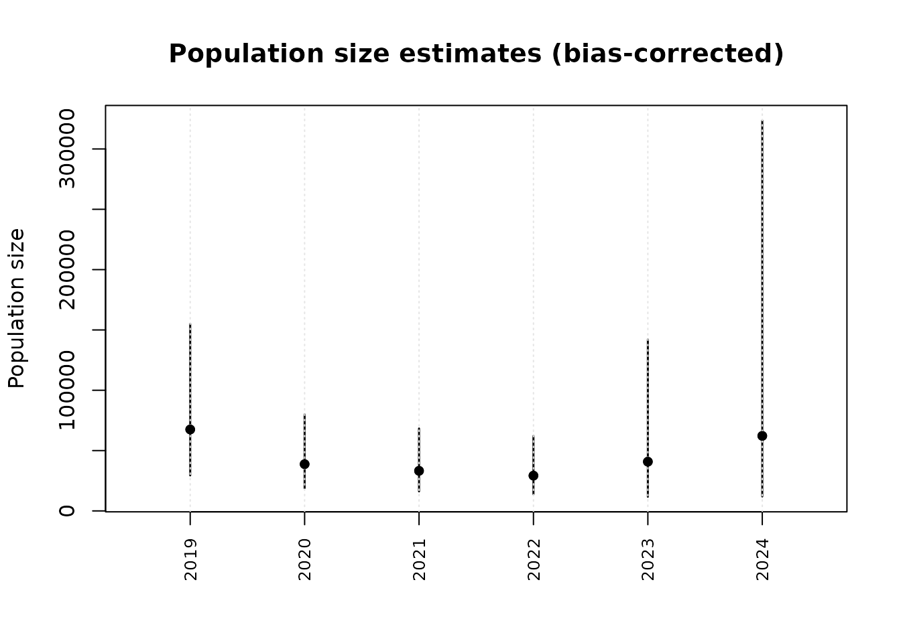
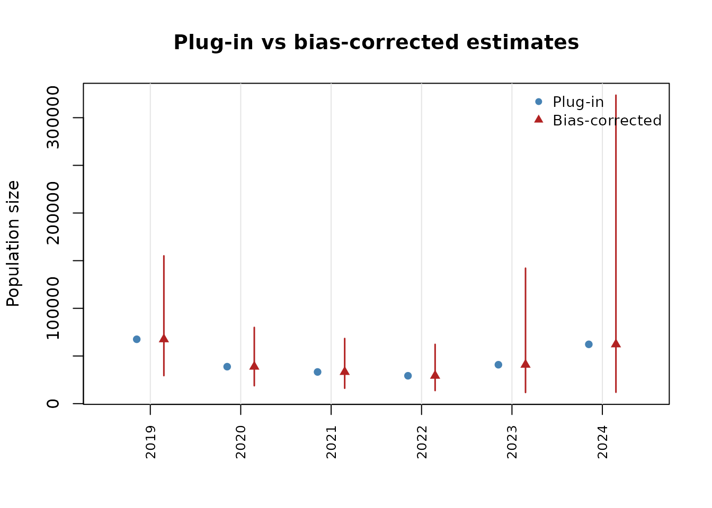
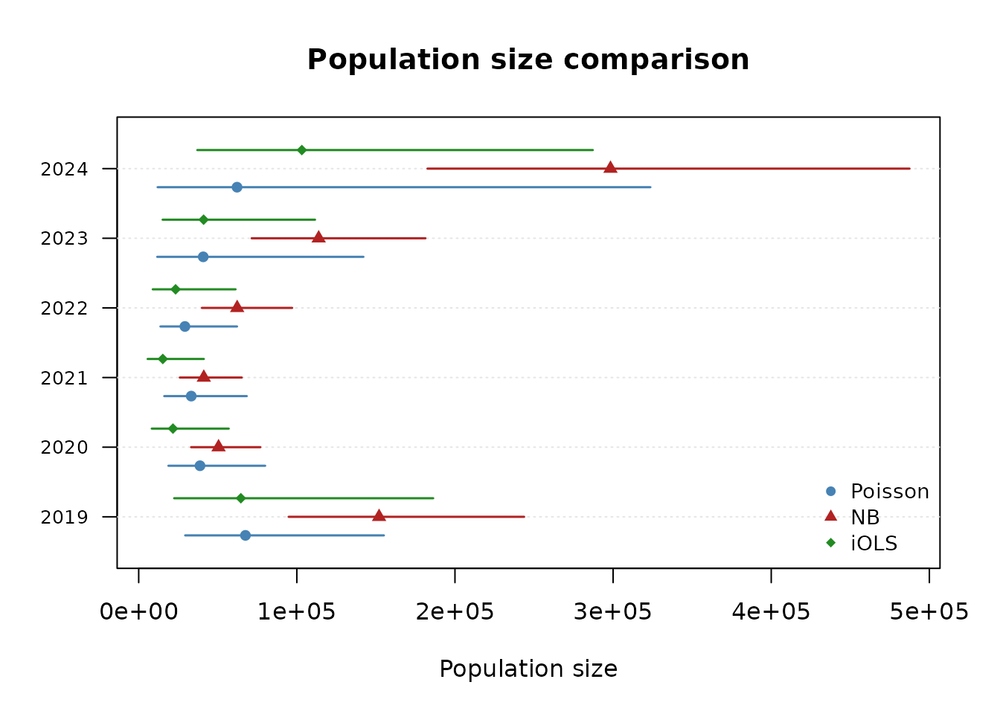

# Model Comparison and Reporting

## Introduction

This vignette demonstrates how to compare estimation methods and present
results using the **uncounted** package’s plotting and reporting tools.

``` r
library(uncounted)
data(irregular_migration)
d <- irregular_migration
```

## Fitting multiple models

The package supports five estimation methods. We fit Poisson, NB, and
iOLS to the same data for comparison:

``` r
fit_po <- estimate_hidden_pop(d, ~ m, ~ n, ~ N,
  method = "poisson", cov_alpha = ~ year + sex,
  gamma = "estimate", countries = ~ country_code)

fit_nb <- estimate_hidden_pop(d, ~ m, ~ n, ~ N,
  method = "nb", cov_alpha = ~ year + sex,
  gamma = fit_po$gamma, countries = ~ country_code)

fit_io <- estimate_hidden_pop(d, ~ m, ~ n, ~ N,
  method = "iols", cov_alpha = ~ year + sex,
  gamma = fit_po$gamma, countries = ~ country_code)
```

## Coefficient tables with modelsummary

The package provides
[`tidy()`](https://generics.r-lib.org/reference/tidy.html) and
[`glance()`](https://generics.r-lib.org/reference/glance.html) methods
compatible with the **modelsummary** package:

``` r
library(modelsummary)
modelsummary(
  list(Poisson = fit_po, NB = fit_nb, iOLS = fit_io),
  stars = TRUE
)
```

|                                                              | Poisson             | NB                  | iOLS                |
|--------------------------------------------------------------|---------------------|---------------------|---------------------|
| alpha × (Intercept)                                          | 0.772\*\*\*         | 0.867\*\*\*         | 0.764\*\*\*         |
|                                                              | (0.050)             | (0.026)             | (0.065)             |
| alpha × year2020                                             | -0.062\*\*          | -0.112\*\*\*        | -0.116\*\*\*        |
|                                                              | (0.022)             | (0.016)             | (0.024)             |
| alpha × year2021                                             | -0.093\*\*\*        | -0.148\*\*\*        | -0.169\*\*\*        |
|                                                              | (0.023)             | (0.019)             | (0.026)             |
| alpha × year2022                                             | -0.122\*\*\*        | -0.127\*\*\*        | -0.141\*\*\*        |
|                                                              | (0.025)             | (0.018)             | (0.028)             |
| alpha × year2023                                             | -0.097\*            | -0.077\*\*\*        | -0.092\*\*\*        |
|                                                              | (0.046)             | (0.016)             | (0.021)             |
| alpha × year2024                                             | -0.060              | 0.008               | -0.008              |
|                                                              | (0.058)             | (0.016)             | (0.020)             |
| alpha × sexMale                                              | 0.042               | 0.017               | 0.049\*             |
|                                                              | (0.038)             | (0.012)             | (0.023)             |
| beta                                                         | 0.613\*\*\*         | 0.783\*\*\*         | 0.638\*\*\*         |
|                                                              | (0.122)             | (0.032)             | (0.071)             |
| Num.Obs.                                                     | 1382                | 1382                | 1382                |
| AIC                                                          | 17569.0             | 5303.9              | 925616.0            |
| BIC                                                          | 17616.1             | 5351.0              | 925657.9            |
| Log.Lik.                                                     | -8775.519           | -2642.969           | -462800.005         |
| method                                                       | POISSON             | NB                  | IOLS                |
| gamma                                                        | 0.00608424005899526 | 0.00608424005899526 | 0.00608424005899526 |
| theta                                                        |                     | 1.27644192579842    |                     |
| \+ p \< 0.1, \* p \< 0.05, \*\* p \< 0.01, \*\*\* p \< 0.001 |                     |                     |                     |

Individual coefficient tables:

``` r
tidy(fit_po, conf.int = TRUE)
#>                term    estimate  std.error statistic      p.value    conf.low
#> 1 alpha:(Intercept)  0.77178226 0.05038723 15.317021 5.885391e-53  0.67302510
#> 2    alpha:year2020 -0.06192406 0.02186837 -2.831672 4.630527e-03 -0.10478528
#> 3    alpha:year2021 -0.09301570 0.02299452 -4.045125 5.229521e-05 -0.13808413
#> 4    alpha:year2022 -0.12230316 0.02471916 -4.947707 7.509273e-07 -0.17075183
#> 5    alpha:year2023 -0.09657813 0.04587434 -2.105276 3.526732e-02 -0.18649017
#> 6    alpha:year2024 -0.05981455 0.05793392 -1.032462 3.018559e-01 -0.17336295
#> 7     alpha:sexMale  0.04179193 0.03766337  1.109617 2.671640e-01 -0.03202693
#> 8              beta  0.61326700 0.12228095  5.015229 5.297029e-07  0.37360074
#>      conf.high
#> 1  0.870539417
#> 2 -0.019062843
#> 3 -0.047947274
#> 4 -0.073854502
#> 5 -0.006666076
#> 6  0.053733853
#> 7  0.115610781
#> 8  0.852933262
glance(fit_po)
#>    method nobs    logLik      AIC      BIC deviance df.residual      gamma
#> 1 POISSON 1382 -8775.519 17569.04 17616.12 14948.24        1373 0.00608424
#>   theta
#> 1    NA
```

## Plotting population size estimates

The
[`popsize()`](https://ncn-foreigners.github.io/uncounted/reference/popsize.md)
function returns an object that can be plotted directly:

``` r
# By year
ps <- popsize(fit_po, by = ~ year)
plot(ps)
```



``` r

# Compare plug-in vs bias-corrected
plot(ps, type = "compare")
```



## Comparing models visually

[`compare_popsize()`](https://ncn-foreigners.github.io/uncounted/reference/compare_popsize.md)
produces side-by-side population size estimates:

``` r
comp <- compare_popsize(fit_po, fit_nb, fit_io,
  labels = c("Poisson", "NB", "iOLS"),
  by = ~ year)

print(comp)
#> Population size comparison: Poisson vs NB vs iOLS 
#> 
#>      model group  estimate estimate_bc      lower     upper
#> 1  Poisson  2019  67536.82    67504.27  29387.545 155059.79
#> 2  Poisson  2020  38787.40    38766.50  18790.590  79978.42
#> 3  Poisson  2021  33243.00    33224.94  16150.794  68349.37
#> 4  Poisson  2022  29249.60    29233.11  13739.448  62198.62
#> 5  Poisson  2023  40825.91    40804.83  11715.865 142117.87
#> 6  Poisson  2024  62218.64    62188.79  11951.532 323594.12
#> 7       NB  2019 156232.34   152016.51  94807.736 243746.13
#> 8       NB  2020  51813.98    50505.28  33151.812  76942.49
#> 9       NB  2021  42132.32    41172.70  25999.199  65201.68
#> 10      NB  2022  63811.34    62276.23  39962.895  97048.25
#> 11      NB  2023 116535.47   113818.22  71444.423 181324.00
#> 12      NB  2024 305601.39   298352.93 182612.483 487450.09
#> 13    iOLS  2019  65745.60    64612.46  22417.079 186231.69
#> 14    iOLS  2020  21998.77    21671.80   8247.430  56947.07
#> 15    iOLS  2021  15444.43    15246.52   5642.189  41199.70
#> 16    iOLS  2022  23655.47    23334.47   8887.968  61262.29
#> 17    iOLS  2023  41622.38    41061.37  15118.862 111518.70
#> 18    iOLS  2024 104625.28   103172.12  37066.202 287175.00
plot(comp)
```



## Predictions

The [`predict()`](https://rdrr.io/r/stats/predict.html) method supports
new data:

``` r
# Fitted values
head(predict(fit_po))
#> [1]  3.2837235  0.3538451  2.3653570  2.2142437 21.0701288  0.8119223

# Log-scale (linear predictor)
head(predict(fit_po, type = "link"))
#> [1]  1.1889780 -1.0388959  0.8609290  0.7949109  3.0478563 -0.2083506

# Predictions for new data
new_d <- d[1:10, ]
predict(fit_po, newdata = new_d)
#>  [1]  3.2837235  0.3538451  2.3653570  2.2142437 21.0701288  0.8119223
#>  [7]  3.9496910  2.1480208  0.4921350 84.9170390
```

## Model selection guidance

| Situation                      | Recommended method             |
|--------------------------------|--------------------------------|
| Default analysis               | Poisson (robust, well-studied) |
| Overdispersion suspected       | NB, then LR test vs Poisson    |
| Sensitivity to large countries | iOLS alongside Poisson         |
| Quick exploration              | OLS with fixed gamma           |

When Poisson and iOLS agree, the result is robust to the choice of
weighting. When they diverge, report both and discuss which observations
drive the difference.

## References

- Santos Silva, J. M. C. & Tenreyro, S. (2006). The Log of Gravity.
  *Review of Economics and Statistics*, 88(4), 641–658.
- Benatia, D., Bellego, C. & Pape, L.-D. (2024). Dealing with Logs and
  Zeros in Regression Models. arXiv:2203.11820v3.
- Zhang, L.-C. (2008). *Developing methods for determining the number of
  unauthorized foreigners in Norway* (Documents 2008/11). Statistics
  Norway.
- Beresewicz, M. & Pawlukiewicz, K. (2020). Estimation of the number of
  irregular foreigners in Poland using non-linear count regression
  models. arXiv:2008.09407.
