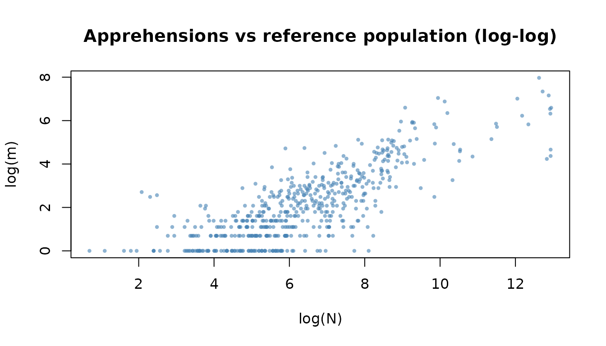
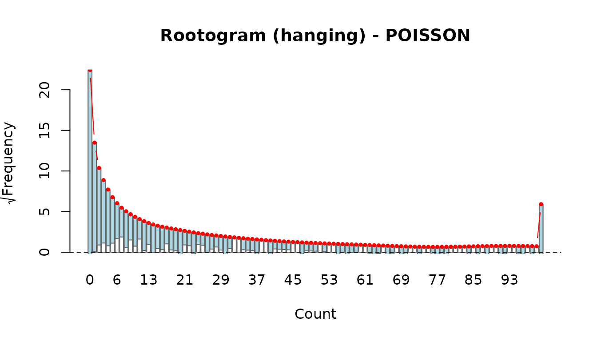
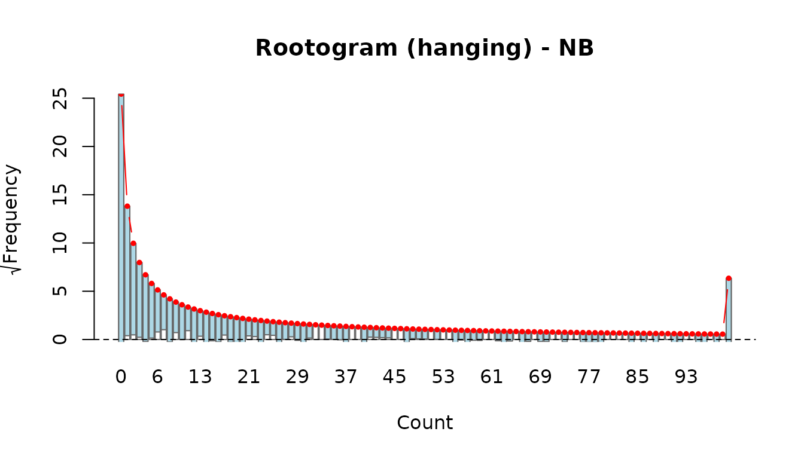
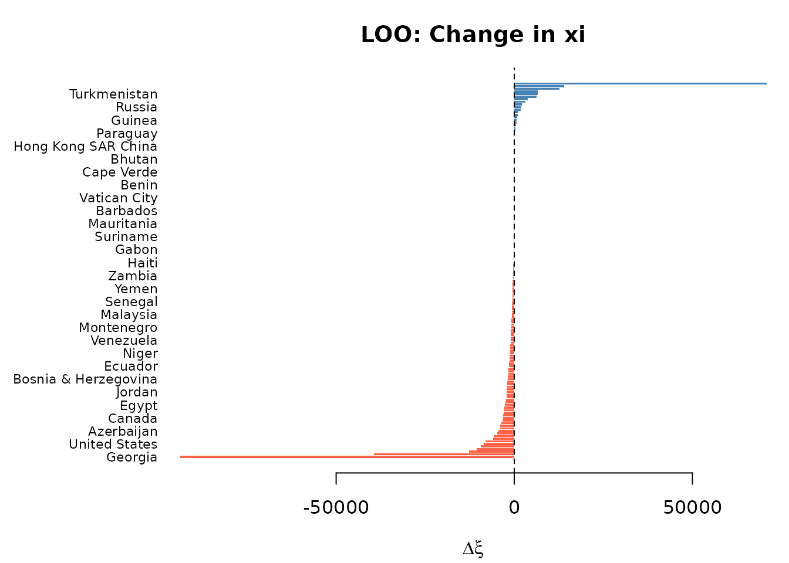
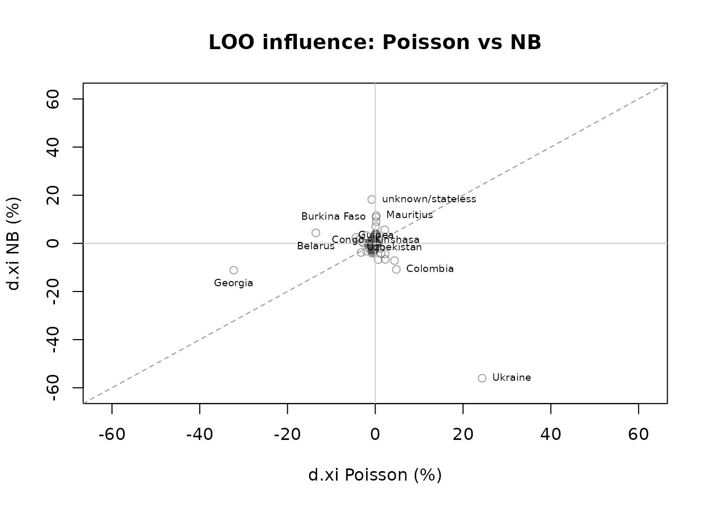
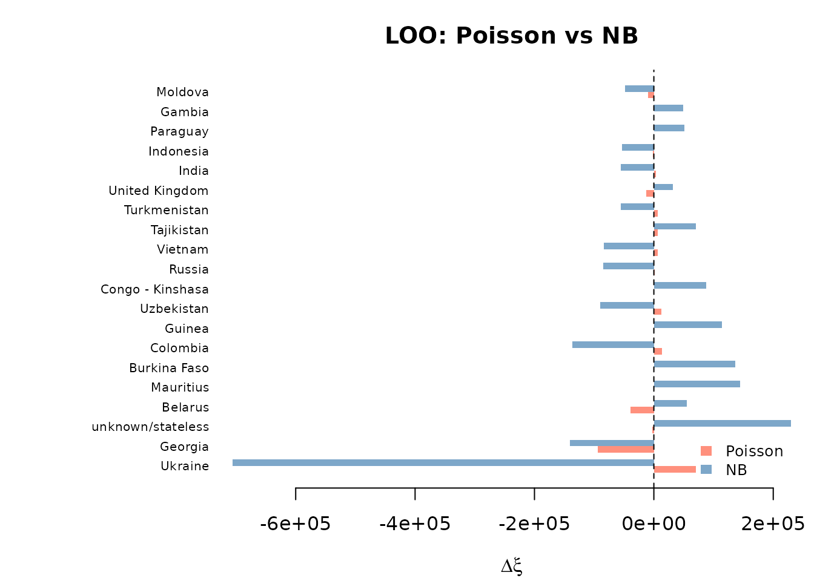
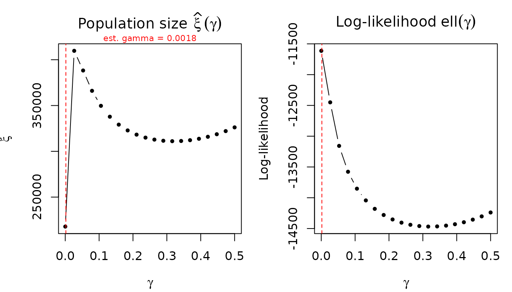

# Complete Analysis Workflow

## Introduction

This vignette walks through a complete analysis estimating the
unauthorized foreign population in Poland using the
`irregular_migration` dataset shipped with the **uncounted** package.
The workflow covers every step from loading the data through fitting
models, obtaining population size estimates with confidence intervals,
running bootstrap inference, selecting among competing specifications,
and performing sensitivity analysis. By the end you will have a
reproducible pipeline that can be adapted to other datasets.

``` r
library(uncounted)
```

## Data Exploration

The `irregular_migration` dataset is a country-level panel (2019–2024)
with three count variables per observation:

- **m** – foreigners apprehended by the Border Guard for unauthorized
  stay (the quantity whose hidden population we want to estimate).
- **n** – foreigners identified by the Police (an auxiliary, partially
  overlapping administrative source).
- **N** – foreigners registered in the Social Insurance Institution
  (ZUS), used as a proxy for the total known foreign population from a
  given country.

``` r
data(irregular_migration)
str(irregular_migration)
#> 'data.frame':    1382 obs. of  8 variables:
#>  $ year        : Factor w/ 6 levels "2019","2020",..: 1 1 1 1 1 1 1 1 1 1 ...
#>  $ sex         : Factor w/ 2 levels "Female","Male": 1 1 1 1 1 1 1 1 1 1 ...
#>  $ country_code: chr  "AFG" "AGO" "ALB" "ARG" ...
#>  $ country     : chr  "Afghanistan" "Angola" "Albania" "Argentina" ...
#>  $ continent   : chr  "Asia" "Africa" "Europe" "Americas" ...
#>  $ m           : int  0 2 0 0 8 2 2 1 0 55 ...
#>  $ n           : int  0 0 1 1 17 0 1 1 0 59 ...
#>  $ N           : int  269 15 64 52 1089 44 219 47 23 11023 ...
```

A large share of observations have zero apprehensions, reflecting the
many small countries of origin with no recorded unauthorized stay.

``` r
cat("Share m == 0:", round(mean(irregular_migration$m == 0) * 100, 1), "%\n")
#> Share m == 0: 48.6 %
cat("Share n == 0:", round(mean(irregular_migration$n == 0) * 100, 1), "%\n")
#> Share n == 0: 48.3 %
```

A log–log scatter of the apprehension count against the reference
population reveals the power-law relationship that motivates the model.
Observations with `m > 0` and `n > 0` are shown.

``` r
pos <- irregular_migration$m > 0 & irregular_migration$n > 0
plot(
  log(irregular_migration$N[pos]),
  log(irregular_migration$m[pos]),
  xlab = "log(N)", ylab = "log(m)",
  main = "Apprehensions vs reference population (log-log)",
  pch = 16, cex = 0.6, col = adjustcolor("steelblue", 0.6)
)
```



## Fitting Models

We fit four specifications, all using the same formula interface. The
core model is

$$E\left( m_{i} \right) = N_{i}^{\alpha}\,\left( \gamma + n_{i}/N_{i} \right)^{\beta},$$

where $\alpha$ governs the elasticity with respect to the reference
population, $\beta$ captures the relationship with the auxiliary
detection rate, and $\gamma$ is a baseline offset ensuring the rate term
is positive even when $n_{i} = 0$.

### Model 1: Poisson (unconstrained, estimated gamma)

This is the recommended default. Poisson pseudo-maximum likelihood
(PPML) is consistent for the conditional mean even under
heteroscedasticity, and gamma is estimated jointly.

``` r
fit_pois <- estimate_hidden_pop(
  data = irregular_migration,
  observed = ~ m,
  auxiliary = ~ n,
  reference_pop = ~ N,
  method = "poisson",
  gamma = "estimate",
  countries = ~ country
)
summary(fit_pois)
#> Unauthorized population estimation
#> Method: POISSON | estimator: MLE | link_rho: power | vcov: HC3 
#> N obs: 1382 
#> Gamma: 0.001831 (estimated) 
#> Log-likelihood: -11380.65 
#> AIC: 22767.3  BIC: 22782.99 
#> Deviance: 20158.5 
#> 
#> Coefficients:
#>       Estimate Std. Error z value  Pr(>|z|)    
#> alpha 0.736646   0.040258  18.298 < 2.2e-16 ***
#> beta  0.575046   0.091861   6.260  3.85e-10 ***
#> ---
#> Signif. codes:  0 '***' 0.001 '**' 0.01 '*' 0.05 '.' 0.1 ' ' 1
#> 
#> -----------------------
#> Population size estimation results:
#>   (BC = bias-corrected using model-based variance)
#>       Observed Estimate Estimate (BC) CI lower CI upper
#> (all)   27,105  290,597       290,498  127,726  660,703
```

Key output to look for:

- **alpha** – the elasticity with respect to `N`. Values below 1
  indicate that the unauthorized population grows less than
  proportionally with the reference population.
- **beta** – the elasticity with respect to the detection rate. Positive
  values mean higher auxiliary rates are associated with more
  apprehensions.
- **gamma** – the estimated baseline offset (typically small).

### Model 2: Poisson constrained (alpha in (0,1), beta \> 0)

Constraining alpha to the unit interval and beta to be positive enforces
theoretical expectations. Internally, alpha is parameterised via a
inverse logit link and beta via an exponential link, so the reported
coefficients are on the link scale.

``` r
fit_pois_c <- estimate_hidden_pop(
  data = irregular_migration,
  observed = ~ m,
  auxiliary = ~ n,
  reference_pop = ~ N,
  method = "poisson",
  gamma = "estimate",
  constrained = TRUE,
  countries = ~ country
)
summary(fit_pois_c)
#> Unauthorized population estimation
#> Method: POISSON | estimator: MLE | link_rho: power | vcov: HC3 
#> N obs: 1382 
#> Gamma: 0.001831 (estimated) 
#> Log-likelihood: -11380.65 
#> AIC: 22767.3  BIC: 22782.99 
#> Deviance: 20158.5 
#> 
#> Coefficients (link scale: logit for alpha, log for beta):
#>       Estimate Std. Error z value  Pr(>|z|)    
#> alpha  1.02861    0.20752  4.9568 7.167e-07 ***
#> beta  -0.55331    0.15974 -3.4637 0.0005328 ***
#> ---
#> Signif. codes:  0 '***' 0.001 '**' 0.01 '*' 0.05 '.' 0.1 ' ' 1
#> 
#> Response-scale parameters (alpha in (0,1), beta > 0):
#>   Alpha (response scale):
#>        alpha SE(alpha)
#> (all) 0.7366    0.0403
#>   Beta (response scale):
#>    beta SE(beta)
#> 1 0.575   0.0919
#> 
#> -----------------------
#> Population size estimation results:
#>   (BC = bias-corrected using model-based variance)
#>       Observed Estimate Estimate (BC) CI lower CI upper
#> (all)   27,105  290,597       290,520  127,736  660,752
```

The [`summary()`](https://rdrr.io/r/base/summary.html) output reports
both link-scale coefficients (with standard errors and p-values) and
response-scale alpha/beta values with delta-method standard errors.

### Model 3: Negative Binomial (estimated gamma)

The NB model adds a dispersion parameter theta to accommodate
overdispersion beyond what Poisson allows.

``` r
fit_nb <- estimate_hidden_pop(
  data = irregular_migration,
  observed = ~ m,
  auxiliary = ~ n,
  reference_pop = ~ N,
  method = "nb",
  gamma = "estimate",
  countries = ~ country
)
summary(fit_nb)
#> Unauthorized population estimation
#> Method: NB | estimator: MLE | link_rho: power | vcov: HC1 
#> N obs: 1382 
#> Gamma: 0.01901 (estimated) 
#> Theta (NB dispersion): 1.0616 
#> Log-likelihood: -2693.48 
#> AIC: 5394.97  BIC: 5415.89 
#> Deviance: 1272.2 
#> 
#> Coefficients:
#>       Estimate Std. Error z value  Pr(>|z|)    
#> alpha 0.871636   0.023598  36.938 < 2.2e-16 ***
#> beta  1.034268   0.080113  12.910 < 2.2e-16 ***
#> ---
#> Signif. codes:  0 '***' 0.001 '**' 0.01 '*' 0.05 '.' 0.1 ' ' 1
#> 
#> -----------------------
#> Population size estimation results:
#>   (BC = bias-corrected using model-based variance)
#>       Observed  Estimate Estimate (BC) CI lower  CI upper
#> (all)   27,105 1,259,565     1,231,405  731,348 2,073,376
```

### Model 4: NB two-stage (gamma from Poisson, fixed in NB)

A pragmatic two-stage approach: first estimate gamma from the Poisson
model (which is better identified), then fix it in the NB model. This
avoids potential numerical instability when estimating gamma and theta
simultaneously.

``` r
gamma_from_pois <- fit_pois$gamma

fit_nb2 <- estimate_hidden_pop(
  data = irregular_migration,
  observed = ~ m,
  auxiliary = ~ n,
  reference_pop = ~ N,
  method = "nb",
  gamma = gamma_from_pois,
  countries = ~ country
)
summary(fit_nb2)
#> Unauthorized population estimation
#> Method: NB | estimator: MLE | link_rho: power | vcov: HC1 
#> N obs: 1382 
#> Gamma: 0.001831 (fixed) 
#> Theta (NB dispersion): 0.9491 
#> Log-likelihood: -2727.07 
#> AIC: 5460.14  BIC: 5475.84 
#> Deviance: 1267.27 
#> 
#> Coefficients:
#>       Estimate Std. Error z value  Pr(>|z|)    
#> alpha 0.745560   0.015958  46.721 < 2.2e-16 ***
#> beta  0.597130   0.023991  24.890 < 2.2e-16 ***
#> ---
#> Signif. codes:  0 '***' 0.001 '**' 0.01 '*' 0.05 '.' 0.1 ' ' 1
#> 
#> -----------------------
#> Population size estimation results:
#>   (BC = bias-corrected using model-based variance)
#>       Observed Estimate Estimate (BC) CI lower CI upper
#> (all)   27,105  318,958       315,415  227,269  437,749
```

## Population Size Estimates

The
[`popsize()`](https://ncn-foreigners.github.io/uncounted/reference/popsize.md)
function extracts the estimated total unauthorized population
$\widehat{\xi} = \sum_{i}N_{i}^{\widehat{\alpha}}$ along with
bias-corrected estimates and confidence intervals.

``` r
ps_pois <- popsize(fit_pois)
ps_pois
#>   group observed estimate estimate_bc    lower    upper share_pct
#> 1 (all)    27105 290597.5    290498.3 127726.5 660703.2       100
```

The columns are:

- **group** – label for each alpha-covariate group (here `"(all)"` since
  we have no covariates on alpha).
- **observed** – total observed count $\sum m_{i}$.
- **estimate** – plug-in estimate $\widehat{\xi}$.
- **estimate_bc** – analytical bias-corrected estimate. For
  unconstrained fits this is the multiplicative lognormal correction;
  constrained fits use a second-order Taylor approximation.
- **lower**, **upper** – confidence interval bounds. The CI is
  constructed by a delta-method/log-normal approximation on the
  population-size scale. When bias correction is requested, the bounds
  are rescaled by the same `estimate_bc / estimate` ratio as the
  reported point estimate.
- **share_pct** – group share as a percentage of the total.

Comparing across all four models:

``` r
models <- list(
  Poisson       = fit_pois,
  Poisson_constr = fit_pois_c,
  NB            = fit_nb,
  NB_twostage   = fit_nb2
)

ps_table <- do.call(rbind, lapply(names(models), function(nm) {
  ps <- popsize(models[[nm]])
  data.frame(
    Model    = nm,
    Estimate = sum(ps$estimate),
    BC       = sum(ps$estimate_bc),
    Lower    = sum(ps$lower),
    Upper    = sum(ps$upper)
  )
}))
ps_table
#>            Model  Estimate        BC    Lower     Upper
#> 1        Poisson  290597.5  290498.3 127726.5  660703.2
#> 2 Poisson_constr  290597.4  290520.0 127736.0  660752.4
#> 3             NB 1259565.1 1231405.2 731347.6 2073376.4
#> 4    NB_twostage  318957.8  315415.1 227268.8  437749.0
```

### Stratified population size

The `by` parameter allows computing population size by any variable in
the data, not just the `cov_alpha` groups. This is useful when alpha
varies by sex but you want totals by year, continent, or country.

``` r
# Population size by year (using the same fitted alpha)
popsize(fit_pois, by = ~ factor(year))
#>   group observed estimate estimate_bc    lower     upper share_pct
#> 1  2019     6604 34740.15    34728.96 15668.65  76975.39  11.95473
#> 2  2020     3398 37922.61    37910.19 16980.31  84638.17  13.04987
#> 3  2021     3105 44585.25    44570.31 19761.08 100526.53  15.34261
#> 4  2022     2949 54737.15    54717.55 23564.68 127054.99  18.83607
#> 5  2023     4362 58339.62    58319.12 25297.63 134444.19  20.07575
#> 6  2024     6687 60272.72    60252.19 26470.29 137147.23  20.74096

# By continent
popsize(fit_pois, by = ~ continent)
#>               group observed    estimate estimate_bc     lower       upper
#> 1            Africa     1304  13815.9922  13814.6005  8830.440  21611.9685
#> 2          Americas      931  11053.0208  11051.7099  6830.840  17880.7125
#> 3              Asia    10968  69969.5623  69956.2510 37521.511 130428.5697
#> 4            Europe    13826 192230.5742 192148.0311 74709.969 494189.2833
#> 5           Oceania       14    441.4146    441.3908   317.687    613.2635
#> 6 unknown/stateless       62   3086.9290   3086.3378  1635.242   5825.1215
#>   share_pct
#> 1  4.754340
#> 2  3.803550
#> 3 24.077827
#> 4 66.150114
#> 5  0.151899
#> 6  1.062270

# By country (one estimate per country)
popsize(fit_pois, by = ~ country)
#>                           group observed     estimate  estimate_bc        lower
#> 1                   Afghanistan      105 9.119921e+02 9.118978e+02   571.839655
#> 2                       Albania       48 6.449181e+02 6.448573e+02   414.173001
#> 3                       Algeria      134 9.401771e+02 9.400628e+02   569.178374
#> 4                       Andorra        0 2.250028e+01 2.250016e+01    20.287783
#> 5                        Angola       16 2.742567e+02 2.742408e+02   193.851934
#> 6                     Argentina       55 6.756971e+02 6.756311e+02   430.732951
#> 7                       Armenia      178 2.646683e+03 2.646260e+03  1480.598315
#> 8                         Aruba        0 2.246309e+00 2.246301e+00     2.059782
#> 9                     Australia       11 3.152167e+02 3.151966e+02   219.262356
#> 10                   Azerbaijan      272 2.410165e+03 2.409763e+03  1335.419654
#> 11                      Bahamas        0 2.776547e+00 2.776531e+00     2.488844
#> 12                   Bangladesh      186 2.392320e+03 2.391876e+03  1285.425150
#> 13                     Barbados        0 1.578150e+01 1.578138e+01    13.927294
#> 14                      Belarus     1415 3.134119e+04 3.133030e+04 13318.921209
#> 15                       Belize        0 2.350442e+01 2.350364e+01    18.031633
#> 16                        Benin        1 1.802780e+01 1.802768e+01    15.985785
#> 17                       Bhutan        0 4.492617e+00 4.492601e+00     4.119563
#> 18                      Bolivia        2 1.402283e+02 1.402229e+02   106.007413
#> 19         Bosnia & Herzegovina        4 2.399503e+02 2.399357e+02   168.320138
#> 20                     Botswana        0 1.592818e+01 1.592804e+01    13.953434
#> 21                       Brazil       54 1.359581e+03 1.359411e+03   814.084187
#> 22       British Virgin Islands        0 1.141252e+01 1.141244e+01    10.146023
#> 23                 Burkina Faso        7 1.481437e+01 1.481429e+01    13.365768
#> 24                      Burundi        2 6.584413e+01 6.584216e+01    51.339927
#> 25                     Cambodia        0 4.799067e+01 4.799013e+01    41.224288
#> 26                     Cameroon       37 4.463644e+02 4.463306e+02   299.909452
#> 27                       Canada       15 4.742113e+02 4.741748e+02   317.488445
#> 28                   Cape Verde        0 6.442844e+00 6.442826e+00     6.059840
#> 29     Central African Republic        0 1.519824e+01 1.519809e+01    13.302840
#> 30                         Chad        1 1.171201e+01 1.171196e+01    10.672976
#> 31                        Chile        7 2.501084e+02 2.500938e+02   176.777916
#> 32                        China      181 3.314422e+03 3.313851e+03  1813.217523
#> 33                     Colombia      634 2.650545e+03 2.650018e+03  1397.416939
#> 34                      Comoros        0 4.193127e+00 4.193080e+00     3.596265
#> 35          Congo - Brazzaville       15 4.130730e+02 4.130429e+02   279.750489
#> 36             Congo - Kinshasa        3 1.000000e+00 1.000000e+00           NA
#> 37                   Costa Rica        0 2.303829e+02 2.303711e+02   166.184430
#> 38                Cote d'Ivoire        3 1.116227e+02 1.116193e+02    87.087298
#> 39                         Cuba       28 5.112564e+02 5.112138e+02   337.146759
#> 40                       Cyprus        0 1.234401e+02 1.234355e+02    93.908940
#> 41           Dominican Republic        2 1.041464e+02 1.041434e+02    81.777889
#> 42                      Ecuador        3 1.915230e+02 1.915144e+02   141.139927
#> 43                        Egypt      120 1.353337e+03 1.353144e+03   785.371678
#> 44                  El Salvador        1 7.093653e+01 7.093499e+01    57.666411
#> 45                      Eritrea        1 2.021741e+01 2.021717e+01    17.329042
#> 46                     Ethiopia       51 7.068323e+02 7.067631e+02   449.735542
#> 47  French Southern Territories        0 1.377164e+01 1.377145e+01    11.669258
#> 48                        Gabon        0 2.950714e+01 2.950690e+01    26.075182
#> 49                       Gambia       15 8.410463e+01 8.410176e+01    64.710096
#> 50                      Georgia     4429 1.091516e+04 1.091224e+04  5162.550439
#> 51                        Ghana       36 3.472638e+02 3.472387e+02   236.157712
#> 52                      Grenada        0 2.666297e+00 2.666295e+00     2.576702
#> 53                    Guatemala        7 2.217124e+02 2.216993e+02   156.563369
#> 54                       Guinea       20 1.107083e+02 1.107046e+02    85.388108
#> 55                       Guyana        0 2.234075e+01 2.234059e+01    19.910266
#> 56                        Haiti        0 3.452667e+01 3.452615e+01    29.105425
#> 57                     Honduras        1 5.787926e+01 5.787799e+01    46.905957
#> 58          Hong Kong SAR China        0 2.246309e+00 2.246301e+00     2.059782
#> 59                        India      826 7.781253e+03 7.779333e+03  3790.381617
#> 60                    Indonesia      246 2.951830e+03 2.951298e+03  1598.031901
#> 61                         Iran       60 8.589064e+02 8.588176e+02   539.065027
#> 62                         Iraq      178 5.354914e+02 5.354432e+02   347.751223
#> 63                      Ireland        0 6.531086e+02 6.530446e+02   416.092497
#> 64                       Israel       13 5.091178e+02 5.090747e+02   334.790100
#> 65                      Jamaica        2 5.590925e+01 5.590836e+01    46.863785
#> 66                        Japan        5 6.574956e+02 6.574375e+02   427.033392
#> 67                       Jordan       24 4.299590e+02 4.299238e+02   285.143499
#> 68                   Kazakhstan      155 2.462591e+03 2.462204e+03  1384.897331
#> 69                        Kenya       36 6.650420e+02 6.649792e+02   426.687324
#> 70                       Kuwait        0 1.730154e+01 1.730134e+01    15.084624
#> 71                   Kyrgyzstan      171 1.194061e+03 1.193904e+03   709.127738
#> 72                         Laos        0 3.712930e+01 3.712871e+01    31.066777
#> 73                      Lebanon       18 4.729089e+02 4.728693e+02   311.893842
#> 74                      Liberia        1 8.185209e+00 8.185174e+00     7.512948
#> 75                        Libya       16 1.750429e+02 1.750330e+02   124.405864
#> 76              Macao SAR China        0 5.849755e+00 5.849656e+00     4.841283
#> 77                   Madagascar        0 6.216191e+01 6.216057e+01    50.498104
#> 78                       Malawi        0 9.392338e+00 9.392194e+00     7.885198
#> 79                     Malaysia        7 2.107512e+02 2.107414e+02   154.283129
#> 80                         Mali        8 1.673426e+02 1.673341e+02   121.590827
#> 81                   Mauritania        0 2.870659e+01 2.870633e+01    25.161601
#> 82                    Mauritius       14 1.039031e+02 1.038997e+02    80.357425
#> 83                       Mexico       20 9.402926e+02 9.401918e+02   585.099162
#> 84                      Moldova     1386 7.641569e+03 7.639800e+03  3800.246490
#> 85                     Mongolia       60 6.424447e+02 6.423889e+02   418.748937
#> 86                   Montenegro        2 9.889813e+01 9.889423e+01    74.423734
#> 87                      Morocco      115 9.787626e+02 9.786491e+02   598.620281
#> 88                   Mozambique        3 8.918057e+01 8.917804e+01    70.179503
#> 89              Myanmar (Burma)        1 6.036308e+01 6.036161e+01    48.405374
#> 90                      Namibia        1 1.595491e+01 1.595481e+01    14.318544
#> 91                        Nepal      228 3.241029e+03 3.240418e+03  1731.461716
#> 92                  New Zealand        3 1.186191e+02 1.186153e+02    91.808739
#> 93                    Nicaragua        2 7.124506e+01 7.124319e+01    56.916580
#> 94                        Niger        1 2.221460e+02 2.221339e+02   159.128460
#> 95                      Nigeria      207 1.325439e+03 1.325264e+03   784.358028
#> 96              North Macedonia       14 3.627556e+02 3.627307e+02   248.644064
#> 97                         Oman        0 1.575925e+01 1.575889e+01    12.629732
#> 98                     Pakistan      154 1.221848e+03 1.221692e+03   729.220920
#> 99      Palestinian Territories       14 2.628414e+02 2.628231e+02   179.858189
#> 100                      Panama        0 5.674112e+01 5.673997e+01    46.589978
#> 101            Papua New Guinea        0 5.332595e+00 5.332590e+00     5.153404
#> 102                    Paraguay       11 7.899193e+01 7.898903e+01    60.535276
#> 103                        Peru       18 5.090880e+02 5.090459e+02   336.293381
#> 104                 Philippines      285 4.713272e+03 4.712308e+03  2447.312805
#> 105            Pitcairn Islands        0 2.246309e+00 2.246301e+00     2.059782
#> 106                       Qatar        0 2.262079e+01 2.262006e+01    17.433075
#> 107                      Russia     1020 7.076380e+03 7.074812e+03  3569.048619
#> 108                      Rwanda       61 7.785388e+02 7.784588e+02   490.004407
#> 109         Sao Tome & Principe        0 5.332595e+00 5.332590e+00     5.153404
#> 110                Saudi Arabia       23 9.920815e+01 9.920516e+01    77.655066
#> 111                     Senegal       11 1.479975e+02 1.479911e+02   110.096128
#> 112                      Serbia       17 6.233233e+02 6.232427e+02   370.844108
#> 113                Sierra Leone        2 4.006803e+01 4.006746e+01    33.849193
#> 114                   Singapore        0 6.603345e+01 6.603232e+01    54.753807
#> 115                     Somalia       11 6.710475e+01 6.710307e+01    53.556018
#> 116                South Africa       28 4.797128e+02 4.796766e+02   322.127327
#> 117                 South Korea       33 6.827032e+02 6.826338e+02   431.795688
#> 118                   Sri Lanka       57 5.857002e+02 5.856379e+02   368.177661
#> 119                   St. Lucia        0 2.776547e+00 2.776531e+00     2.488844
#> 120                       Sudan       16 1.179993e+02 1.179948e+02    89.355979
#> 121                    Suriname        0 3.838724e+01 3.838684e+01    33.128146
#> 122                       Syria      228 7.655525e+02 7.654716e+02   479.115742
#> 123                      Taiwan        6 2.308852e+02 2.308740e+02   167.776832
#> 124                  Tajikistan      393 8.820420e+02 8.819379e+02   538.453621
#> 125                    Tanzania       17 2.635501e+02 2.635347e+02   186.114621
#> 126                    Thailand       34 9.185074e+02 9.184110e+02   574.154280
#> 127                        Togo        1 5.328275e+01 5.328140e+01    42.386596
#> 128           Trinidad & Tobago        0 1.652514e+01 1.652499e+01    14.457750
#> 129                     Tunisia       85 1.002552e+03 1.002432e+03   608.845986
#> 130                      Turkey      394 4.366648e+03 4.365741e+03  2258.470467
#> 131                Turkmenistan      385 1.271760e+03 1.271571e+03   731.402069
#> 132                      Uganda       20 3.124547e+02 3.124346e+02   216.974512
#> 133                     Ukraine     9901 1.412361e+05 1.411684e+05 51604.813275
#> 134        United Arab Emirates        1 3.743018e+00 3.742983e+00     3.249516
#> 135              United Kingdom       19 2.261041e+03 2.260677e+03  1265.107477
#> 136               United States       38 1.589667e+03 1.589455e+03   935.240799
#> 137           unknown/stateless       62 3.086929e+03 3.086338e+03  1635.241633
#> 138                     Uruguay        1 1.334334e+02 1.334289e+02   102.547265
#> 139                  Uzbekistan      925 3.110260e+03 3.109650e+03  1642.317896
#> 140                Vatican City        0 1.503438e+01 1.503431e+01    13.608365
#> 141                   Venezuela       30 5.065006e+02 5.064594e+02   335.499027
#> 142                     Vietnam      677 5.685575e+03 5.684391e+03  2929.984233
#> 143                       Yemen       16 2.272124e+02 2.271979e+02   158.129244
#> 144                      Zambia        8 1.585480e+02 1.585414e+02   118.370708
#> 145                    Zimbabwe      180 1.546967e+03 1.546751e+03   901.664789
#>            upper    share_pct
#> 1   1.454180e+03 3.138334e-01
#> 2   1.004027e+03 2.219283e-01
#> 3   1.552621e+03 3.235324e-01
#> 4   2.495379e+01 7.742766e-03
#> 5   3.879662e+02 9.437681e-02
#> 6   1.059769e+03 2.325199e-01
#> 7   4.729638e+03 9.107730e-01
#> 8   2.449709e+00 7.729965e-04
#> 9   4.531053e+02 1.084719e-01
#> 10  4.348415e+03 8.293827e-01
#> 11  3.097472e+00 9.554614e-04
#> 12  4.450722e+03 8.232417e-01
#> 13  1.788228e+01 5.430706e-03
#> 14  7.369874e+04 1.078509e+01
#> 15  3.063621e+01 8.088308e-03
#> 16  2.033038e+01 6.203702e-03
#> 17  4.899418e+00 1.545993e-03
#> 18  1.854819e+02 4.825515e-02
#> 19  3.420217e+02 8.257135e-02
#> 20  1.818207e+01 5.481184e-03
#> 21  2.270033e+03 4.678570e-01
#> 22  1.283692e+01 3.927260e-03
#> 23  1.641980e+01 5.097900e-03
#> 24  8.444091e+01 2.265819e-02
#> 25  5.586640e+01 1.651448e-02
#> 26  6.642371e+02 1.536023e-01
#> 27  7.081888e+02 1.631849e-01
#> 28  6.850017e+00 2.217103e-03
#> 29  1.736336e+01 5.229995e-03
#> 30  1.285208e+01 4.030320e-03
#> 31  3.538162e+02 8.606697e-02
#> 32  6.056422e+03 1.140554e+00
#> 33  5.025413e+03 9.121018e-01
#> 34  4.888939e+00 1.442933e-03
#> 35  6.098450e+02 1.421461e-01
#> 36            NA 3.441186e-04
#> 37  3.193490e+02 7.927904e-02
#> 38  1.430619e+02 3.841144e-02
#> 39  7.751508e+02 1.759328e-01
#> 40  1.622458e+02 4.247804e-02
#> 41  1.326258e+02 3.583872e-02
#> 42  2.598682e+02 6.590663e-02
#> 43  2.331380e+03 4.657084e-01
#> 44  8.725655e+01 2.441058e-02
#> 45  2.358665e+01 6.957187e-03
#> 46  1.110684e+03 2.432341e-01
#> 47  1.625236e+01 4.739076e-03
#> 48  3.339027e+01 1.015396e-02
#> 49  1.093045e+02 2.894197e-02
#> 50  2.306555e+04 3.756108e+00
#> 51  5.105685e+02 1.194999e-01
#> 52  2.759003e+00 9.175225e-04
#> 53  3.139341e+02 7.629537e-02
#> 54  1.435270e+02 3.809678e-02
#> 55  2.506758e+01 7.687866e-03
#> 56  4.095645e+01 1.188127e-02
#> 57  7.141655e+01 1.991733e-02
#> 58  2.449709e+00 7.729965e-04
#> 59  1.596621e+04 2.677674e+00
#> 60  5.450555e+03 1.015780e+00
#> 61  1.368235e+03 2.955657e-01
#> 62  8.244383e+02 1.842726e-01
#> 63  1.024934e+03 2.247468e-01
#> 64  7.740882e+02 1.751969e-01
#> 65  6.669851e+01 1.923941e-02
#> 66  1.012155e+03 2.262565e-01
#> 67  6.482157e+02 1.479569e-01
#> 68  4.377543e+03 8.474233e-01
#> 69  1.036350e+03 2.288533e-01
#> 70  1.984382e+01 5.953780e-03
#> 71  2.010084e+03 4.108984e-01
#> 72  4.437348e+01 1.277688e-02
#> 73  7.169278e+02 1.627367e-01
#> 74  8.917548e+00 2.816683e-03
#> 75  2.462630e+02 6.023552e-02
#> 76  7.068058e+00 2.013009e-03
#> 77  7.651647e+01 2.139107e-02
#> 78  1.118720e+01 3.232078e-03
#> 79  2.878599e+02 7.252339e-02
#> 80  2.302864e+02 5.758569e-02
#> 81  3.275043e+01 9.878471e-03
#> 82  1.343392e+02 3.575500e-02
#> 83  1.510788e+03 3.235722e-01
#> 84  1.535862e+04 2.629606e+00
#> 85  9.854677e+02 2.210772e-01
#> 86  1.314106e+02 3.403269e-02
#> 87  1.599936e+03 3.368104e-01
#> 88  1.133197e+02 3.068869e-02
#> 89  7.527106e+01 2.077206e-02
#> 90  1.777807e+01 5.490381e-03
#> 91  6.064421e+03 1.115298e+00
#> 92  1.532489e+02 4.081903e-02
#> 93  8.917598e+01 2.451675e-02
#> 94  3.100858e+02 7.644456e-02
#> 95  2.239188e+03 4.561081e-01
#> 96  5.291642e+02 1.248309e-01
#> 97  1.966332e+01 5.423051e-03
#> 98  2.046747e+03 4.204606e-01
#> 99  3.840580e+02 9.044862e-02
#> 100 6.910121e+01 1.952567e-02
#> 101 5.518007e+00 1.835045e-03
#> 102 1.030683e+02 2.718259e-02
#> 103 7.705407e+02 1.751866e-01
#> 104 9.073562e+03 1.621925e+00
#> 105 2.449709e+00 7.729965e-04
#> 106 2.935037e+01 7.784235e-03
#> 107 1.402417e+04 2.435114e+00
#> 108 1.236720e+03 2.679097e-01
#> 109 5.518007e+00 1.835045e-03
#> 110 1.267356e+02 3.413937e-02
#> 111 1.989294e+02 5.092868e-02
#> 112 1.047425e+03 2.144971e-01
#> 113 4.742806e+01 1.378816e-02
#> 114 7.963405e+01 2.272334e-02
#> 115 8.407685e+01 2.309199e-02
#> 116 7.142818e+02 1.650781e-01
#> 117 1.079189e+03 2.349309e-01
#> 118 9.315386e+02 2.015503e-01
#> 119 3.097472e+00 9.554614e-04
#> 120 1.558124e+02 4.060575e-02
#> 121 4.448028e+01 1.320976e-02
#> 122 1.222975e+03 2.634409e-01
#> 123 3.177007e+02 7.945190e-02
#> 124 1.444534e+03 3.035271e-01
#> 125 3.731600e+02 9.069248e-02
#> 126 1.469080e+03 3.160755e-01
#> 127 6.697655e+01 1.833559e-02
#> 128 1.888781e+01 5.686607e-03
#> 129 1.650450e+03 3.449967e-01
#> 130 8.439205e+03 1.502645e+00
#> 131 2.210675e+03 4.376363e-01
#> 132 4.498933e+02 1.075215e-01
#> 133 3.861757e+05 4.860198e+01
#> 134 4.311386e+00 1.288042e-03
#> 135 4.039706e+03 7.780664e-01
#> 136 2.701301e+03 5.470341e-01
#> 137 5.825122e+03 1.062270e+00
#> 138 1.736105e+02 4.591690e-02
#> 139 5.887971e+03 1.070298e+00
#> 140 1.660968e+01 5.173611e-03
#> 141 7.645362e+02 1.742963e-01
#> 142 1.102815e+04 1.956512e+00
#> 143 3.264349e+02 7.818802e-02
#> 144 2.123445e+02 5.455931e-02
#> 145 2.653357e+03 5.323400e-01
```

The total across all `by`-groups equals the total from the default
grouping.

## Bootstrap Inference

The
[`bootstrap_popsize()`](https://ncn-foreigners.github.io/uncounted/reference/bootstrap_popsize.md)
function uses the fractional weighted bootstrap (FWB) of Xu et
al. (2020). Cluster bootstrap by country is recommended to account for
within-country correlation across years.

``` r
set.seed(2025)
boot_pois <- bootstrap_popsize(
  fit_pois,
  R = 49,
  cluster = ~ country_code,
  ci_type = "perc",
  seed = 2025
)
boot_pois
#> Bootstrap population size estimation
#> R = 49 | CI type: perc | Point estimate: median | Converged: 49 / 49 
#> Cluster bootstrap
#> 95% CI
#> 
#>   Point estimate: bootstrap median (recommended) | CI: bootstrap percentile
#>        Plugin Plugin (BC) Boot median Boot mean CI lower  CI upper
#> (all) 290,597     290,498     313,360   388,859  166,247 1,004,604
# #> Bootstrap population size estimation
# #> R = 49 | CI type: perc | Point estimate: median | Converged: 998 / 999
# #> Cluster bootstrap
# #> 95% CI
```

Access the detailed results:

``` r
# Main table (selected point estimate + CI)
boot_pois$popsize
#>   group estimate    lower   upper
#> 1 (all) 313359.5 166247.2 1004604

# Full table with all point estimate types
boot_pois$popsize_full
#>   group   plugin plugin_bc boot_median boot_mean    lower   upper
#> 1 (all) 290597.5  290498.3    313359.5  388859.4 166247.2 1004604

# Bootstrap distribution summary
summary(boot_pois)
#> Bootstrap population size estimation
#> R = 49 | CI type: perc | Point estimate: median | Converged: 49 / 49 
#> Cluster bootstrap
#> 95% CI
#> 
#>   Point estimate: bootstrap median (recommended) | CI: bootstrap percentile
#>        Plugin Plugin (BC) Boot median Boot mean CI lower  CI upper
#> (all) 290,597     290,498     313,360   388,859  166,247 1,004,604
#> 
#> Bootstrap distribution summary:
#>         mean     sd q025.2.5% q50.50% q975.97.5%
#> (all) 388859 219713    166247  313360    1004604
#> 
#> Parameter bootstrap summary:
#>           mean       sd q025.2.5%  q50.50% q975.97.5%
#> alpha 0.750484 0.045538  0.681888 0.740070   0.851456
#> beta  0.612625 0.124395  0.427185 0.598194   0.847812
#> gamma 0.002943 0.003415  0.000276 0.001936   0.012459
```

### Comparing bootstrap and analytical CIs

``` r
ps_analytical <- popsize(fit_pois)
data.frame(
  Type       = c("Analytical", "Bootstrap"),
  Estimate   = c(sum(ps_analytical$estimate_bc),
                 boot_pois$popsize$estimate),
  Lower      = c(sum(ps_analytical$lower),
                 boot_pois$popsize$lower),
  Upper      = c(sum(ps_analytical$upper),
                 boot_pois$popsize$upper)
)
#>         Type Estimate    Lower     Upper
#> 1 Analytical 290498.3 127726.5  660703.2
#> 2  Bootstrap 313359.5 166247.2 1004604.0
```

The bootstrap median is typically smaller than the plug-in estimate.
This is expected: $\xi(\alpha) = \sum N_{i}^{\alpha}$ is convex in
$\alpha$ for $N_{i} > 1$, so by Jensen’s inequality
$E\left\lbrack \widehat{\xi} \right\rbrack \geq \xi$. The bootstrap mean
inherits this upward bias, while the bootstrap median is more robust to
the right skew of the bootstrap distribution and is therefore the
recommended point estimate.

## Model Selection

### Information criteria and fit statistics

``` r
comp <- compare_models(
  Poisson        = fit_pois,
  Poisson_constr = fit_pois_c,
  NB             = fit_nb,
  NB_twostage    = fit_nb2,
  sort_by = "AIC"
)
comp
#> Model comparison
#> ------------------------------------------------------------ 
#>           Model  Method Estimator  Link Constrained n_par    logLik      AIC
#>              NB      NB       MLE power       FALSE     4  -2693.48  5394.97
#>     NB_twostage      NB       MLE power       FALSE     3  -2727.07  5460.14
#>  Poisson_constr POISSON       MLE power        TRUE     3 -11380.65 22767.30
#>         Poisson POISSON       MLE power       FALSE     3 -11380.65 22767.30
#>       BIC Deviance Pearson_X2   RMSE R2_cor R2_D  R2_CW
#>   5415.89  1272.20    2943.93 139.85 0.5168    0 0.9432
#>   5475.84  1267.27    2600.28  82.27 0.5620    0 0.9442
#>  22782.99 20158.50   25366.63  81.47 0.5623    0 0.9749
#>  22782.99 20158.50   25366.63  81.47 0.5623    0 0.9749
```

The output includes three pseudo $R^{2}$ measures: `R2_cor` (squared
correlation), `R2_D` (explained deviance relative to a null model
without covariates, see Cameron & Trivedi, 2013), and `R2_CW`
(Cameron–Windmeijer, 1997, which accounts for the model’s variance
function).

**Note on `R2_D`**: The null model is the same specification (same
method, same gamma) but without `cov_alpha` / `cov_beta` — i.e., a
single $\alpha$ and single $\beta$. If your model already has no
covariates, then model = null and `R2_D = 0` by construction. `R2_D`
becomes informative when you compare models with covariates (e.g.,
`cov_alpha = ~ year + sex`) against the covariate-free baseline: it
tells you how much of the deviance is explained by group-varying
parameters beyond the basic power-law structure.

### Likelihood ratio test: Poisson vs NB

``` r
lr <- lrtest(fit_pois, fit_nb)
lr
#> Likelihood ratio test
#> ---------------------------------------- 
#> Model 1: POISSON   (logLik = -11380.65 )
#> Model 2: NB   (logLik = -2693.48 )
#> LR statistic: 17374.33 on 1 df
#> (Boundary-corrected: 0.5 * P(chi2 > LR), Self & Liang 1987)
#> p-value: < 2.2e-16
```

When comparing Poisson (H0) against NB (H1), the dispersion parameter
theta lies on the boundary of its parameter space under H0
($\left. \theta\rightarrow\infty \right.$). The function automatically
applies the Self & Liang (1987) correction, yielding
$p = 0.5 \cdot \Pr\left( \chi_{1}^{2} > LR \right)$.

### Diagnostics

The four-panel diagnostic plot shows fitted vs observed, Anscombe
residuals, scale-location, and a normal Q-Q plot.

``` r
par(mfrow = c(2, 2))
plot(fit_pois, ask = FALSE)
```


The rootogram compares observed and fitted count frequencies. Hanging
bars that touch the zero line indicate a good fit.

``` r
rootogram(fit_pois)
```



``` r
rootogram(fit_nb)
```



### Why Poisson as the main model?

Despite the NB often having a better AIC/BIC (reflecting genuine
overdispersion), the Poisson model is recommended as the primary
specification for several reasons:

1.  **Consistency.** Poisson PML is consistent for the conditional mean
    as long as $E\left( m_{i}|X_{i} \right)$ is correctly specified,
    regardless of the true variance function. The NB requires correct
    specification of both the mean and the variance.
2.  **Robustness.** HC-robust standard errors correct for overdispersion
    in the Poisson model without adding an extra parameter that must be
    estimated.
3.  **Stability.** The NB model’s joint estimation of gamma and theta
    can be numerically fragile when many observations are zero. The
    two-stage approach mitigates this but introduces a conditioning
    step.

The NB results serve as a useful robustness check on the population size
estimate.

### Exploratory log-log plots

The
[`plot_explore()`](https://ncn-foreigners.github.io/uncounted/reference/plot_explore.md)
function produces marginal log-log scatterplots that visualise the
power-law relationships.

``` r
plot_explore(fit_pois)
```


## Sensitivity Analysis

### Leave-one-out by country

LOO analysis refits the model dropping one country at a time and reports
the change in $\widehat{\xi}$.

``` r
loo_pois <- loo(fit_pois, by = "country")
print(loo_pois)
#> Leave-one-out sensitivity analysis
#> Dropped by: country 
#> N iterations: 145 
#> Converged: 145 / 145 
#> 
#> Full model xi: 290597.5 
#> LOO xi range: 196868.9 to 361377.4 
#> 
#> Most influential (by |delta xi|):
#>         dropped      dxi pct_change
#>         Georgia -93728.6     -32.25
#>         Ukraine  70779.9      24.36
#>         Belarus -39385.1     -13.55
#>        Colombia  13949.6       4.80
#>  United Kingdom -12755.2      -4.39
#>      Uzbekistan  12663.0       4.36
#>           China -10480.7      -3.61
#>         Moldova  -9454.8      -3.25
#>   United States  -8654.7      -2.98
#>          Turkey  -8060.7      -2.77
# #> Leave-one-out sensitivity analysis
# #> Dropped by: country
# #> ...
# #> Most influential (by |delta xi|):
# #>   dropped      dxi  pct_change
# #>   Ukraine  -12345.0       -8.50
# #>   ...
```

``` r
plot(loo_pois)
```



The coefficient stability summary shows how much alpha and beta shift:

``` r
summary(loo_pois)
#> Leave-one-out sensitivity analysis
#> Dropped by: country 
#> N iterations: 145 (converged: 145 )
#> 
#> === Coefficient stability ===
#>           full loo_mean   loo_sd  loo_min  loo_max
#> alpha 0.736646 0.737121 0.009246 0.702614 0.841615
#> beta  0.575046 0.576312 0.023531 0.500267 0.842030
#> 
#> === Xi stability ===
#> Full xi: 290597.5 
#> LOO mean: 289462.8 
#> LOO range: 196868.9 to 361377.4 
#> Max |%change|: 32.25 %
```

### Comparing LOO across models

``` r
loo_nb <- loo(fit_nb, by = "country")
comp_loo <- compare_loo(loo_pois, loo_nb, labels = c("Poisson", "NB"))
print(comp_loo)
#> LOO comparison: Poisson vs NB 
#> Dropped by: country 
#> Full xi -- Poisson : 290597 | NB : 1259565 
#> 
#> Top 15 most influential (by max |%change|):
#>  label             dxi_Poisson pct_Poisson dxi_NB     pct_NB max_abs_pct
#>  Ukraine            70779.94    24.36      -705761.52 -56.03 56.03      
#>  Georgia           -93728.58   -32.25      -140401.95 -11.15 32.25      
#>  unknown/stateless  -2348.09    -0.81       229311.58  18.21 18.21      
#>  Belarus           -39385.05   -13.55        54858.15   4.36 13.55      
#>  Mauritius            604.17     0.21       144755.46  11.49 11.49      
#>  Burkina Faso         485.49     0.17       136859.62  10.87 10.87      
#>  Colombia           13949.58     4.80      -136731.30 -10.86 10.86      
#>  Guinea               609.84     0.21       113737.82   9.03  9.03      
#>  Uzbekistan         12663.02     4.36       -90267.87  -7.17  7.17      
#>  Congo - Kinshasa     319.44     0.11        88055.75   6.99  6.99      
#>  Russia              1915.03     0.66       -85024.73  -6.75  6.75      
#>  Vietnam             6580.56     2.26       -83357.79  -6.62  6.62      
#>  Tajikistan          6325.07     2.18        70595.99   5.60  5.60      
#>  Turkmenistan        6542.35     2.25       -55727.73  -4.42  4.42      
#>  United Kingdom    -12755.17    -4.39        31442.35   2.50  4.39
plot(comp_loo, type = "scatter")
```



``` r
plot(comp_loo, type = "bar")
```



The scatter plot shows whether the same countries are influential under
both models. Points near the diagonal indicate agreement; points in
off-diagonal quadrants indicate divergent influence.

### Gamma profile

The
[`profile_gamma()`](https://ncn-foreigners.github.io/uncounted/reference/profile_gamma.md)
function refits the model across a grid of fixed gamma values and shows
how $\widehat{\xi}$ and the log-likelihood depend on gamma. A flat xi
profile indicates robustness; a steep profile suggests sensitivity.

``` r
prof <- profile_gamma(fit_pois)
```



The returned data frame can be inspected directly:

``` r
head(prof)
#>        gamma       xi    loglik
#> 1 0.00010000 217823.6 -11613.29
#> 2 0.02641053 409727.4 -12450.12
#> 3 0.05272105 388248.7 -13157.48
#> 4 0.07903158 366068.5 -13577.46
#> 5 0.10534211 349654.2 -13852.40
#> 6 0.13165263 337789.6 -14043.25
```

## Reporting Results

To prepare results for a paper, combine the analytical and bootstrap
estimates into a single summary table.

``` r
# Analytical results
ps_a <- popsize(fit_pois)

# Bootstrap results (assuming boot_pois was computed above)
ps_b <- boot_pois$popsize_full

results <- data.frame(
  Observed         = sum(ps_a$observed),
  Plugin           = round(sum(ps_a$estimate)),
  Plugin_BC        = round(sum(ps_a$estimate_bc)),
  Analytical_Lower = round(sum(ps_a$lower)),
  Analytical_Upper = round(sum(ps_a$upper)),
  Boot_Median      = round(sum(ps_b$boot_median)),
  Boot_Lower       = round(sum(ps_b$lower)),
  Boot_Upper       = round(sum(ps_b$upper))
)
results
#>   Observed Plugin Plugin_BC Analytical_Lower Analytical_Upper Boot_Median
#> 1    27105 290597    290498           127726           660703      313360
#>   Boot_Lower Boot_Upper
#> 1     166247    1004604
```

Extract coefficients for reporting:

``` r
coefs <- coef(fit_pois)
se <- sqrt(diag(vcov(fit_pois)))
ci_lo <- coefs - 1.96 * se
ci_hi <- coefs + 1.96 * se

coef_table <- data.frame(
  Parameter = names(coefs),
  Estimate  = round(coefs, 4),
  SE        = round(se, 4),
  CI_lower  = round(ci_lo, 4),
  CI_upper  = round(ci_hi, 4),
  row.names = NULL
)
coef_table
#>   Parameter Estimate     SE CI_lower CI_upper
#> 1     alpha   0.7366 0.0403   0.6577   0.8156
#> 2      beta   0.5750 0.0919   0.3950   0.7551
```

The estimated gamma and model fit statistics:

``` r
cat("Gamma:", round(fit_pois$gamma, 6), "\n")
#> Gamma: 0.001831
cat("Log-likelihood:", round(fit_pois$loglik, 2), "\n")
#> Log-likelihood: -11380.65
cat("AIC:", round(AIC(fit_pois), 2), "\n")
#> AIC: 22767.3
cat("BIC:", round(BIC(fit_pois), 2), "\n")
#> BIC: 22782.99
cat("Deviance:", round(deviance(fit_pois), 2), "\n")
#> Deviance: 20158.5
```
